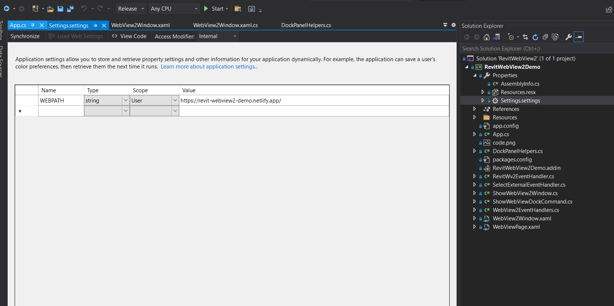

# Revit WebView2 Demo

Prototype for a web interface within Autodesk Revit using WPF + WebView2.

Web apps built with any modern web frameworks can run in the setup demonstrated in this project.
This example uses a web UI built with `Vue.js` with `Vuetify`. The web app is currently hosted [here](https://revit-webview2-demo.netlify.app/).

<!-- gif -->

All Revit interactions from and to the Web UI is defined in [here](web/src/utils/webview2.js)


## Installation

Download and extract the binaries from [here]() to your revit add-ins folder. Current release of `RevitWebView2Demo` was developed with Revit 2021. It should work fine with older versions as well.

## Development Setup

- Clone this repository

### Web

### Revit

## How To

- Change URL End Point

- Passing data between WebView and Revit
  - To Revit
```js
export function postWebView2Message({ action, payload }) {
  if (!action) {
    return;
  }
  // `window.chrome.webview` is only available in webview context
  // you can pass anything as the parameter to postMessage
  // C# will receive it as serialized json
  // { action, payload } is defined for the sake of having a standard message schema
  window.chrome?.webview?.postMessage({ action, payload });
}
```
C# handles the [`WebMessageReceived`](https://github.com/zahmadsaleem/revit-webview2-demo/blob/cd9b8d5ce690964bfa1db953666c5482ce9ee7c1/RevitWebView2Demo/WebViewPage.xaml.cs#L53) received event, when [`postMessage`](https://github.com/zahmadsaleem/revit-webview2-demo/blob/cd9b8d5ce690964bfa1db953666c5482ce9ee7c1/web/src/utils/webview2.js#L45) is called from javascript.
```c#
private void OnWebViewInteraction(object sender, CoreWebView2WebMessageReceivedEventArgs e)
{
    WvReceiveAction result = JsonConvert.DeserializeObject<WvReceiveAction>(e.WebMessageAsJson);
    /* do something with the action and payload received from js*/
    switch (result.action)
    {
        case "select":
            WebView2EventHandlers.HandleSelect(uidoc, e.WebMessageAsJson);
            break;
        case "create-sheet":
            App.RevitWv2Event.Raise(RevitWv2EventHandler.RevitWv2ActionsEnum.CreateSheet);
            break;
        default:
            Debug.WriteLine("action not defined");
            break;
    }
}
```
  - To WebView2


- Executing transactions from the web interface

### Credits

Thanks to [Petr Mitev](https://www.linkedin.com/in/petr-mitev) and [Ehsan Iran-Nejad](https://www.linkedin.com/in/eirannejad/) for guidance and insights.
Special thanks to [Dimitar](https://bg.linkedin.com/in/dimitar-venkov-835a6112) and [Harsh](https://no.linkedin.com/in/harsh-kedia-31a31a70) for support.
